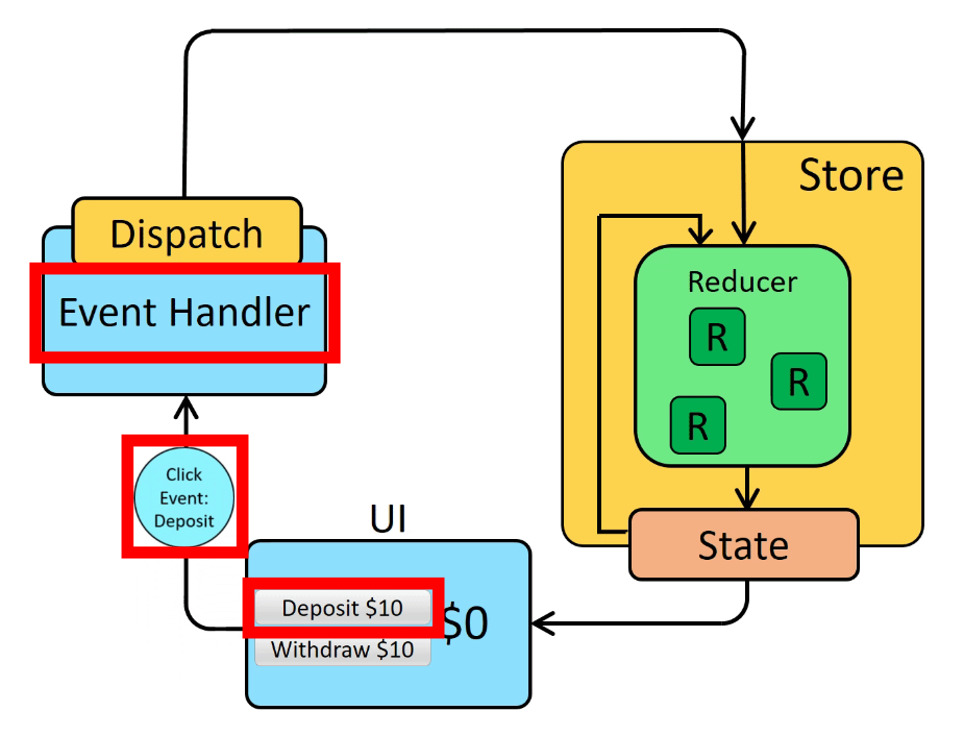

# 1. Sử dụng JavaScript nâng cao\*

## **Function**: Cho biêt cách viết tắt và không viết tắt của function.Ngoài ra nó cho bạn biết thêm về các chường hợp hợp lệ và không hợp lệ.

[VD:Function_JavaScript](./tk_Function.js)

## **Module**: Cho phép bạn kết hợp từ file này đến file khác bằng ( import / export)

_Sử dụng React Basic Cơ bản_

- **Import** : Là nhập vào
- **Export** : Xuất ra một hoặc nhiều biến, hàm, lớp đã được khai báo trong file hiện tại, cho phép file khác sử dụng lại.
- **Export default** : Xuất ra một biến, hàm, lớp mặc định đã được khai báo trong file hiện tại, cho phép file khác sử dụng lại mà không cần chỉ định tên cụ thể.
- **_Lưu ý_**: Sự khác nhau chính giữa export và export default là:
  export: Cho phép xuất ra nhiều biến, hàm, lớp và file khác cần chỉ định tên cụ thể khi sử dụng lại.
  export default: Chỉ cho phép xuất ra một biến, hàm, lớp mặc định và file khác có thể sử dụng lại mà không cần chỉ định tên cụ thể.

[Vd:Sử_dụng_Import_Export](./tk_Module/) ==> Cả ví dụ đó được kết hợp trong Folloder "tk_Module"

## **Object**: Cách khai báo đơn giản trong Object xem ví dụ bên dưới:

[Vd:Sử dụng Object](./tk_Object.js)

## **Gộp Các Objcet + Gộp các Arrays lại với nhau**

- **Object**: Ta có thể gộp 2 hoặc nhiều object lại với nhau bằng cách dùng dấu: chấm chấm (...). Điều này được gọi là "phương thức spread( lấy ra)" và cho phép chúng ta sao chép các thuộc tính của một object vào một object khác.
- **Arrays**: Ta có thể gộp 2 hoặc nhiều Arrays lại với nhau bằng cách dùng dấu: chấm chấm (...). Điều này cũng được gọi là "phương thức spread( lấy ra)" và cho phép chúng ta sao chép các phần tử của một mảng vào một mảng khác.

```javascript
// Ví dụ về gộp object
const obj1 = { a: 1, b: 2 };
const obj2 = { c: 3, d: 4 };
const objGop = { ...obj1, ...obj2 };
console.log(objGop); // { a: 1, b: 2, c: 3, d: 4 }

// Ví dụ về gộp mảng
const arr1 = [1, 2, 3];
const arr2 = [4, 5, 6];
const arrGop = [...arr1, ...arr2];
console.log(arrGop); // [1, 2, 3, 4, 5, 6]
```

## **Cách lấy ra cùng lúc nhiều phần tử Object + Array**

- **Object**: Ta có thể lấy ra cùng lúc nhiều phần tử của một object bằng Destructuring
- **Arrays**: Ta có thể lấy ra cùng lúc nhiều phần tử của một mảng bằng Destructuring

```javascript
//  Sử dụng bject
const obj = { a: 1, b: 2, c: 3 };
const { a, b, c } = obj;
console.log(a, b, c); // 1 2 3

//  Sử dụng Arrays
const arr = [1, 2, 3, 4, 5];
const [a, b, c, d, e] = arr;
console.log(a, b, c, d, e); // 1 2 3 4 5

//  Ngoài ra bạn  cũng có thể dùng Spread để lấy ra các giá trị mong muốn.
// ví dụ dùng trong arays
const [a, ...d] = arr;
console.log(a, d); // 1 [2,3,4,5]
// Ví dụ trên ta chỉ lấy giá trị a  còn giá trị còn lại sẽ được nằm trong arrays. Tương tựa như trong Object cũng vậy.
```

## **Sử dụng toán tử rest trong function**

- **Toán tử rest**: Cho phép chúng ta` lấy ra các phần tử còn lại` của một mảng hoặc một object
- **Công dụng của toán tử rest:**
- Lấy ra các phần tử còn lại của một mảng hoặc một object
- Sao chép các phần tử của một mảng hoặc một object vào một mảng hoặc một object khác

```javascript
// Ví dụ về sử dụng toán tử rest trong function
function cong(...args) {
  let tong = 0;
  for (let arg of args) {
    tong += arg;
  }
  return tong;
}
console.log(cong(1, 2, 3, 4, 5)); // 15

// Ví dụ về sử dụng toán tử rest để truyền tham số vào function
function chao(...ten) {
  console.log(`Xin chào, ${ten.join(", ")}`);
}
chao("Nam", "Hoa", "Linh"); // Xin chào, Nam, Hoa, Linh
```

## **Cách Sử dụng DOM**: Xem lại kiến thức cơ bản của JavaScript đã ghi dõ rồi lên sẽ không nhắc lại

- **Link Dom**: https://github.com/nguyenthanhtung2k4/DNU_JavaScript/raw/refs/heads/main/JavaScript/tk_JacvaScript_BASIC.txt
- **Link Video**: https://www.youtube.com/watch?v=Nno-r1Cz_-I&list=PL_-VfJajZj0UXjlKfBwFX73usByw3Ph9Q&index=8&pp=iAQB

# 2.React Basic : Reacr yêu cầu đặt tên biến phải có chữ đầu viết hoa.

Link :
<script crossorigin src="https://unpkg.com/react@18/umd/react.production.min.js"></script>
<script crossorigin src="https://unpkg.com/react-dom@18/umd/react-dom.production.min.js"></script>
<script src="https://unpkg.com/babel-standalone@6/babel.min.js"></script>

## Phương thức React-CreateElement

- **Phương thức React-CreateElement**: Phương thức này được sử dụng để tạo ra element
- **Cú pháp React:**: React.createElement(type, attchibill, interHtnml , n)  
  [VD: So sánh JavaScript và React](./tk_So_sánh_Js+React-%20CreateElemnet.html)

## React-DOM

- **React @18**: Ở phiên bản này hoạt động khác 1 chút với phiên bản 17.
- **_Chạy render_**:

```javascript
root = ReactDOM.createRoot(document.getElementById("root"));
root.render(element);
```

- **_React @17_**: Phiên bản này có sự khác biệt giữa 17 và 18.

```JavaScript

          ReactDOM.render(elemnet,document.getElementById('root'))
```

- **\* Tóm lại: \*\***: Từ hai ví dụ trên cho bạn biết dõ hơn về sự khác nhau của phiên bản 17 vs 18 ngoài ra cho thấy cách tạo elemnet mới là như nào.

## JSX : mô tả giao diện người dùng nó cho phép chuyẻn đổi từ reacr element sàn javascript thông qua babel

- **Cần CDN**: <script src="https://unpkg.com/babel-standalone@6/babel.min.js"></script>
- **Tham chiếu đền**: dùng dấu {}
- **React.Fragment**: Bao toàn bộ các thẻ elements bên trong để tránh gây xung đột trong jsx

[Vd: Sử dụng JSX và các trường hơp](./tk_React_JSX.html)

## Types : hiểu một cách đơn giản là tạo ra 1 function và nó cho phép người dùng gọi lại

[VD:Sử dụng Types](./tk_React_Types_Function.html)

## Props : hiểu một cách đơn giản là nó cho phép chuyền đối số vào trong hàm , áp dụng cả types vào trong Props

**_Xem ví dụ để hiểu thêm_**
[VD:Sưe dụng dùng tham chiếu ](./tk_React_Props_ThamChieu.html)
[VD: Sử dụng Props vào button](./tk_React_Button.html)

- **_Lưu ý:_** Trong react thì cần phải chuyển tuân thủ theo quy tắc viết thường và in hoa.
- `onClick`: Phải viết theo nó như vậy
- `onDoubleclick`: Phải viết theo đúng quy tắc
- `onMouseOver`: xử lý sự kiện hover nhiều lần (gần như onMouseEnter)
- `onMouseEnter` : Khi di chuyển vào nó sẽ hoạt động hàm đc truyền vào.
- `onMouseLeave`: Khi chuột đang ở trong div đó và bạn đưa chuột ra ngoài, sự kiện **onMouseLeave** sẽ được kích hoạt.

- `Còn rất nhiều các hàm cần thuân thủ theo cần tra thêm1`

### Childen props: Nó cũng là chuyền đối số vào mà trong hàm này nó cho phép bạn sử chuyền nhiều tham số hơn mà không cần viết từng đối số vào.

[Vd: Ví dụ sử dụng Childen props trong React](./tk)

## Component : Phải tuân thủ các quy tắc React: Đặt tên func cần phải viết chữ cái hoa.

- **Đơn giản là** Nó bắt bạn phải tuân thủ của react hãy xem ví dụ bên dưới để có được cái nhìn dõ hơn!
- **Kết hợp toán tử logic** : Trong React cho phép bạn kếtt hợp toán tử trong Component

  `||` : Toán tử hoặc ( xét giá trị null, undify, 0 fase, "" , NaN)

  `??`: Toán tử này xét ( undify và null ) ==> Mục độ xét nhỏ hơn ||

  `&&`: Toán tử Và

  `==`: Toán tử bằng bằng
  **\*Ví dụ bên dưới cho bạn biết cách sử dụng toán tử trong Component\*\***

[Vd:Sử dụng Component trong React](./tk_React_Component.html)
[Vd:Sử dụng toán tử trong Component](./tk_React_Toan_tu.html)

==> Phần bên trên là basic React phải gắn link CDN nó mới có thể chạy được. Bên dưới là React nâng cao hơn chính vì vậy chúng sẽ cần cài môi trường!

## Cấu trúc React:

```bash
my-app/
│── public/                 # Chứa file tĩnh (index.html, favicon, images, v.v.)
│── src/                    # Nơi chứa code chính
│   │── assets/             # Ảnh, CSS, font, icon...
│   │── components/         # Các component tái sử dụng
│   │   │── Header.js
│   │   │── Footer.js
│   │── pages/              # Các trang chính (Home, About, Contact,...)
│   │   │── Home.js
│   │   │── About.js
│   │── hooks/              # Custom hooks (nếu có)
│   │── services/           # API, gọi backend
│   │── App.js              # Component gốc
│   │── index.js            # File khởi động (render React vào DOM)
│   │── App.css             # Style cho App
│── package.json            # Thông tin project, dependencies

```

# 2.REACT nâng cao :

_Để cài được mối trường trước hết phải có Node.js | Sau đó cài gitbash_
**_Cài đặt Node.js_**: Cài đặt Node.js để có thể sử dụng được cậu lệnh để chạy code.
**_Cài GitBash_**: Để cài được npx cài môi trường ảo | npm cài môi trường về máy. or yarn
_Sau khi cài đầy đủ tiếp đến dùng npx để cài được môi trường react_

## Câu lệnh Cài môi trường :

- **npx create-react-app {*Tên_dự*án}** : Cài môi trường trong 1 follder
- **_Nếu trong quá trình cài môi trường bị lỗi có thể thêm câu lệnh này_**:
  ----------------------- **_npm install -g npm@latest_**
- **npm i**: tự động kéo file react cần có về khi chẳng may xóa 1 trong những file bắt buộc phải có nó.
- **npm start** : Chạy môi trường
- **npm run build** : Build môi trường
  -------------- **npm install -g serve**: Cài môi trường để chạy sản phẩm được build ra.
- ------------ **serve -s build**: Chạy môi trường đã được build ra.
- **npm run eject** : Xóa môi trường
- **npm install {_Tên_thư_viện_}** : Cài thư viện
- **npm install {_Tên_thư_viện_} --save** : Cài thư viện
- **npm install {_Tên_thư_viện_} --save-dev** : Cài thư viện dev

- Triển khai cục bộ
```bash
npm install -g server

# cd /go/to/app/root/folder 

serve -s build
# Theo mặc định, serve phục vụ ứng dụng bằng cổng 5000. Ứng dụng có thể được xem tại @ http://localhost:5000 .

```
[Vd:Hiểu dõ hơn về npm, npx, yarn](https://www.youtube.com/watch?v=7sX_8lKURqo&list=PL_-VfJajZj0UXjlKfBwFX73usByw3Ph9Q&index=26)
[Vd:Cấu trúc thư mục hoạt đông trong React](https://www.youtube.com/watch?v=-Ka_3RkQAvk&list=PL_-VfJajZj0UXjlKfBwFX73usByw3Ph9Q&index=27)

## 3.**\*\*** Hook : Được hiểu đơn giản nó là các hàm được tạo sẵn và chỉ lấy ra và áp dụng vào bài của mình.

### 3.1 useState(): Cập nhập thay đổi giá trị trạng thái

**_Cấu trúc_**:
------------- `const [{Gia_tri_LanDau} , {Set_Gia_tri_callback}] = useState;`

- **Dùng khi nào?**: Khi muốn dữ liệu thay đổi thì giao diện tự động được cập nhật (render lại[ theo dữ liệu]).
- **Cách dùng**

```jsx
          import { useState } from 'react'
          function Component() {
          const [state, setState] = useState(initState)

          .......
          }

```

**_Lưu ý_**:

- Component được re-render sau khi 'setState"
- Initial state chỉ dùng cho lần đầu
- Set state với callback?
- Initial state với callback?
- Set state là thay thế state bằng giá
  trị mới

[Vd: Sử dụng Hook useState](./tk_Hook_React_useState.js) Cần build môi trường trước khi chạy code.

#### ------------------ Làm việc với useState ----------------------

#### _1.1 Two-Way- binding(uerState)_: Áp dụng checkbox CheckBox, radio, Fromt, input .....

- **Dùng khi**: Khi bạn cần đồng bộ hóa giá trị của một input form với state trong React và ngược lại.
- **Cách dùng**: Giống như useState vì nó được áp dụng useState để làm ra ràng buộc 2 chiều.

```jsx
     const courses = [{id: 1,name: 'Html'},
     {id: 2,name: 'Python'}
     ];

     function App() {
     const [checked, setChecked] = useState(2); // checked  BanDau= 2
     const [result, setResult] = useState();

     const handleSubmit = () => {
     // Call API
     const api={
          id: checked,
          name: courses.find(course => course.id === checked).name
     }
     console.log(api); /// requesrt ve  phia api
     ///  setResult: dùng để  in ra màn hình
     setResult({
          id: checked,
          name: courses.find(course => course.id === checked).name
     });
     };
     return(
          ....................................
          tham khảo VD check radio  vs checkbox bên dưới !
     )
     }
```

[VD: Radio dung useState](./tk_Hook_React_useState_Radio.js)

[Vd: CheckBox dung useState]()

#### _1.2 to-do-list(useState)_ : Hiện ra các danh sách sử dụng to do list

[Vd: Sử dụng To-do-list](./tk_Hook_)

### 3.2 Thuật ngữ Mounted và UnMounted nó dùng chỉ cho gắn vào và lấy ra.

#### \*Mounted\*\* : Dùng để gắn vào.

#### \*UnMounted\*\* : Dùng để lấy ra.

[Vd: Sử dụn g Mount và UnMounted](<./tk_Hook_React_useState_Mount_UnMount(Gắn%20và%20bỏ).js>)

### 3.3 userEffect : Dùng để xử lý hiệu ứng phụ (side effects) trong component, như lấy dữ liệu, đăng ký sự kiện, hoặc dọn dẹp. ( api , ervent , time.... )

- **=> Khi nào dùng useEffect?**
  - Các tác vụ không cần đồng bộ với DOM hoặc giao diện, chẳng hạn:
  - Gọi API.
  - Lắng nghe sự kiện.
  - Thiết lập hoặc hủy các bộ đếm thời gian.
  - Đăng ký hoặc hủy đăng ký sự kiện (ví dụ: addEventListener).

#### _useEffect_: Có các tính huống sau:

- **+ useEffect({callBack})** : Gọi callBack **_mỗi khi component_** re-render.
- **+ useEffect({callBack}, [])** : Chỉ gọi lại callback **_1 lần_** sau khi component mounted
- **+ useEffect({callBack}, [{giá_trị}])** : CallBack luôn được gọi sau khi **_giá trị_** thay đổi

* > > Lưu ý:CallBack luôn được goị sau khi compoment mounted\*

#### _3.3.1 Update DOM_ : Cập nhập lại title của trang web >>Với callback nhiều lần

- **Cho phép cập nhập lại dữ liệu ở Title DOM**
  [Vd: Sử dụng useEffect để cập nhập lại TitleDOM](./tk_Hook_React_useEffect_UpdateDOM.js)
  ==> ví dụ này dành cho useEffeact(callback) ==> Gọi lại nhiều lần sau khi component

#### _3.3.2 Call API_ : Gọi lại API bằng useEffact >> Với callback 1 lần

- **Dùng callBack 1 lần đ gọi API**

[Vd: Sử dụng useEffect để callBack](./tk_Hook_React_useEffect_Call_API.js)

#### _3.3.3 Call API nhiều giao diện_ Dùng với callBack >> Sử dụng callBack với API và tham số mảng của useEffect

- **Mục đích nó có thể xuất ra được nhiều dữ liệu cùng với 1 trang**

[Vd: Sử dụng useEffect với tham số API](./tk_Hook_React_useEffect_Call_API_Tham_So.js)

#### _3.3.4 DOM Event (Cuộn trang web Scroll )_ >> Sử dụng với useEffect

- _Kiến thứ:_ : Về kiếm thức này yêu cầu người dùng phải nắm được kiến thức cơ bản về JavaScript cơ bản
- _Sử dụng **useEffect** có thể tạo thanh cuộn về trang ban đầu rất mượt mà và trơn tru_

**LƯU Ý:** Sau khi dùng **xong sự kiện event** trong js cần phải xóa sự kiện đi để giảm tối đa tốc độ trình duyệt **tránh dư thừa dữ liệu**

[Vd: Sử dụng useEffect làm thanh cuộn (Scroll)](./tk_Hook_React_useEffect_DomEvent_Thanh_Cuộn.js)

### 3.4 Time đếm ngược >> Sử dụng với useEffect + useState

- **Trong ví dụ có 2 cách để cho tuime đếm ngược**
- **Sau khi khi đếm ngược lại thì phải có hàm clearTiem()**

[Vd:Sử dụng useEffect đếm ngược time](./tk_Hook_React_useEffect_Time_Đếm_Ngược.js)

### 3.5 Dọn dẹp (Update avata) >> Sử dụng với useEffect

- _Để tránh dò dị bộ nhớ_:Ta cần xóa bố nhớ hiện tại trước khi thêm bộ nhớ tiếp theo.
- **Điều này rất quan trọng để tránh tràn bộ nhớ và xung đột.** -_Cú pháp_:

```js
useEffect(() => {
  return () => {
    // Logic cleanup, ví dụ: hủy sự kiện, dọn bộ nhớ, xóa timer...
  };
}, [dependencies]);
```

Ví dụ bên dưới là cập nhập avata và clear bộ nhớ hiện tại để tránh đầy và dò dị bộ nhớ.

[Vd:Sử dụng update avata ( Dọn dẹp trước khi cập nhập)](<./tk_Hook_React_useEffect_Update_AVATA__%20(Dọn%20Dẹp).js>)

### 3.6 Sử lý thời gian thực >> uesEffect

- Vì phần này liên quan đến các file lên có thể tham khảo link ở đây **Link bên dưới**

**Link:** https://www.youtube.com/watch?v=eFrgfL3O_UQ&list=PL_-VfJajZj0UXjlKfBwFX73usByw3Ph9Q&index=41

==> Nó sẽ phát ervent ra và cập nhập thời thực.

### 3.7 useLayoutEffect:

- Dùng khi thực hiện các thao tác đồng bộ hóa:

  - DOM Thay đổi DOM ngay sau khi nó được React cập nhật.
  - Đo kích thước hoặc vị trí của các phần tử DOM (ví dụ: getBoundingClientRect).
  - Điều chỉnh DOM trước khi nó được vẽ lên màn hình (blocking).

- _Lưu ý:_ Không lên lạm dụng quá mức nó khiến làm ảnh hưởng đến hiệu suất.

- **Link tham khảo:** https://www.youtube.com/watch?v=loSqbCbH2xo&list=PL_-VfJajZj0UXjlKfBwFX73usByw3Ph9Q&index=39

[Vd: Sử dung useLayouteffect thay đổi DOM sau khi cập nhập](./tk_)

### 3.8 useRef( {Đối_số_bất_kì} )

_Dùng khi:_ Khi nào dùng useRef?

- Truy cập trực tiếp DOM (input, div, canvas, v.v.).
- **Lưu giá trị mà không cần re-render**.
- Lưu **trạng thái tạm thời** giữa các lần render.
- **Ngăn gọi lại các side-effect** không cần thiết.
  _useRef_: Trả về object

```js
{'current' : {Giá_trị_đã_Truyền_vào}}
```

['Vd:Sử dụng useRef áp dụng điểm dừng của time](./tk_Hook_React_useRef_Điểm_Dừng_Time.js)

**\*Link Tham khảo** nếu chưa hiểu\*: https://www.youtube.com/watch?v=qr1dQqRJRNo&list=PL_-VfJajZj0UXjlKfBwFX73usByw3Ph9Q&index=40

### 3.9 memo(): GHI nhớ một  componese

_Dùng khi_: Kiểm tra sự thay đổi của props nếu có sự kiện thay đổi trong funciton component đó thì thay đổi còn không thì nó sẽ giữ nguyên để giúp web hoạt động 1 cách trơn tru.

_Xem **chi tiết** để hiểu dõ hơn về nó:_ https://www.youtube.com/watch?v=pPoKG_l3UFQ&list=PL_-VfJajZj0UXjlKfBwFX73usByw3Ph9Q&index=41

**Tóm lại:**

- Tóm lại:
  - Trong trường hợp nhiều file mà chỉ thay đổi 1 function commpoment nhỏ bên trong
  - và các compoment khác không thay đổi có thể dùng memo để giúp giảm vấn đề hiệu năng

Bên dưới đây là sự khác nhau khi không dùng memo và khi dùng memo:

- Dùng memo: ['Vd: Sử dụng memo kiểm tra thay đổi của compoment'](./tk_Hook_React_memo_Kiểm_tra_sựThayđổi_trongCompoment.js)

- Không dùng memo: ['Vd: Khi không dùng memo'](./tk_Hook_React_Không_Dùng_memo.js)

### 3.10 useCallback()  GHI nhớ một  Function ( logic )

#### Cách dùng:

- Khi hàm callback được truyền qua props.
- Khi callback ảnh hưởng đến hiệu suất (dùng trong useEffect, useMemo).

#### _useCallBack_: Có các tính huống sau:

- **+ useCallBack({callBack})** : Gọi callBack **_mỗi khi component_** re-render.
- **+ useCallBack({callBack}, [])** : Chỉ gọi lại callback **_1 lần_** sau khi component mounted
- **+ useCallBack({callBack}, [{giá_trị}])** : CallBack luôn được gọi sau khi **_giá trị_** thay đổi

[Vd:Sử dụng useCallback và memo](./tk_Hook_React_useCallback_vs_memo.js
)

### ==> Sự khác nhau của useCallback và memo

#### Tóm tắt

- Khi nào dùng useCallback?

  - Khi hàm callback được truyền qua props.
  - Khi callback ảnh hưởng đến hiệu suất (dùng trong useEffect, useMemo).

- Khi nào dùng React.memo?

  - Khi muốn ngăn component con re-render không cần thiết.

- Khi nào cần cả useCallback và React.memo?

      - Khi bạn truyền một callback từ parent xuống child và muốn child không bị re-render khi parent re-render.

  --> Hầu như khi memo thì thường sẽ dùng useCallback.

### 3.11 useMemo() : Ghi nhớ Giá trị value, là kết quả trả về của một hàm.

#### 3.11.1 Cách dùng: Tránh những logic lập lại không cần thiết.

#### Các cú pháp trong useMemo:

- **useMemo({callBack})** : Gọi callBack **_mỗi khi component_** re-render.
- **useMemo({callBack}, [])** : Chỉ gọi lại callback **_1 lần_** sau khi component mounted
- **useMemo({callBack}, [{giá_trị}])** : CallBack luôn được gọi sau khi **_giá trị_** thay đổi

==> Cách dùng giống như các hàm Hook khác trong react ( useEffect,useCallback.. )

[Vd:Sử dụng useMemo]( ./tk_Hook_React_useMemo.js)

#### 3.11.2 Sự khác nhau của useMemo và memo:

- **useMemo**: Tránh những logic lập lại không cần thiết.
- **React.memo**: Tránh những component con không cần thiết re-render.

### 3.12 useReducer()

- Dùng useState có thể giải quyết được thì useReducer cũng có thể giải quyết được.
- Khi nào dùng useReducer: Phức tạp sử dụng nhiều tầng arr , các components nhiều phức tạp.

```js
// #  Cú pháp: 
const [state, dispatch] = useReducer(reducer, initialState);
```
- Trong đó:

  - reducer: hàm nhận vào (state, action) → trả về state mới.

  - initialState: state khởi tạo (có thể là object hoặc giá trị đơn).

  - state: state hiện tại.

  - dispatch: hàm để gửi action (object có { type, payload }).

[Ví dụ code bassic ở đây](./tk_Hook_React_useReducer_basic.js)

[Ví dụ code defficult ở đây](./tk_Hook_React_useReducer_Defficult.js.js)

#### So sánh useState với useReduccer

| Tiêu chí              | `useState` 🟢                                                    | `useReducer` 🔵                                                                |
| --------------------- | ---------------------------------------------------------------- | ------------------------------------------------------------------------------ |
| **Độ phức tạp state** | Phù hợp khi state **đơn giản** (1–2 biến).                       | Phù hợp khi state **phức tạp**, nhiều field hoặc nhiều cách cập nhật.          |
| **Cách cập nhật**     | Gọi trực tiếp `setState(newValue)` hoặc `setState(prev => ...)`. | Gửi action qua `dispatch({ type, payload })`, reducer sẽ quyết định state mới. |
| **Logic cập nhật**    | Viết **trực tiếp trong component**.                              | Tách logic ra reducer → **tập trung, dễ tái sử dụng**.                         |
| **Độ dài code**       | Ngắn gọn, dễ hiểu, ít boilerplate.                               | Dài hơn, cần định nghĩa action + reducer.                                      |
| **Tính mở rộng**      | Hơi khó quản lý khi state có nhiều biến và nhiều thao tác.       | Dễ mở rộng, thêm action mới chỉ cần viết thêm case trong reducer.              |
| **Khi nên dùng**      | Form nhập liệu nhỏ, toggle, counter, state ít thay đổi.          | Todo list, giỏ hàng, form nhiều bước, app có logic cập nhật phức tạp.          |

👉 Tóm lại:

- useState → đơn giản, nhanh gọn.

- useReducer → phức tạp hơn nhưng mạnh khi quản lý nhiều action/state.


### Tóm lại  trên  Memo &  UseCallback & UseMemo 

Đây là bảng tóm tắt so sánh ba công cụ tối ưu hóa hiệu suất trong React (`React.memo`, `useCallback`, và `useMemo`) theo định dạng Markdown:

| Công cụ | Trách nhiệm Chính | Đối tượng Áp dụng |
| :--- | :--- | :--- |
| **`React.memo`** | Chặn re-render của component con nếu props không thay đổi. | **Component** (JSX/UI) |
| **`useCallback`** | Ổn định **tham chiếu của Function** (Hàm). | **Props là Hàm** |
| **`useMemo`** | Ổn định **tham chiếu của Value** (Giá trị, Object, Array) hoặc kết quả tính toán phức tạp. | **Props là Dữ liệu** hoặc **Tính toán nặng** |
### 3.13 useContext() QUản lý state  toàn cục

- Khi nào dùng nó: Hiểu đơn giản thì nó được dùng khi mà muốn truyền trực tiếp `từ a-> c` thay `vì truyền a -> b -> c` (b là biến trung gian giữa a , c )

- Làm code sạch hơn: Loại bỏ việc truyền props không cần thiết.

`Cách dùng`: Trong phần này chúng ta cần sử dụng import nhiều file chính vì thế nó khá là phức tạp

- Link tham khảo: https://www.youtube.com/watch?v=TENin-HxvRg&list=PL_-VfJajZj0UXjlKfBwFX73usByw3Ph9Q&index=48


```js
// > Cú pháp:
const value = useContext(MyContext);
```
#### VD  về sử dụng  Context trong React dự cơ bản về nó.
```js
///// index.js
import React from "react";
import ReactDOM from "react-dom/client";
import "./index.css";
import App from "./App"; 
import reportWebVitals from "./reportWebVitals";
import { ThemeProvider } from "./ThemeContext";
const root = ReactDOM.createRoot(document.getElementById("root"));
root.render(
  <React.StrictMode>
    <ThemeProvider>
      <App />
    </ThemeProvider>
  </React.StrictMode>
);

reportWebVitals();
//  Trong phần này phải cho ThêmProvider ôm trọn app  để nó có thể  gọi ra bất cứ cấu file nhỏ nào trong App
```

```js
// /////  App.js
import { useContext } from "react";
import { ThemeContext } from "./ThemeContext";
import Paragragh from "./Paragraph";

const App = () => {
  const context = useContext(ThemeContext);
  return (
    <div>
      <button onClick={context.toggleColor}>buttong</button>
      <Paragragh />
    </div>
  );
};

export default App;

/// Trong file này dùng để  Chứa các file nhỏ nằm trong App và dùng useContext
```

```js
//  ThemeContext.js
import { createContext, useState } from "react";

const ThemeContext = createContext();

function ThemeProvider({ children }) {
  const [color, setColor] = useState("light");

  const toggleColor = () => {
    setColor(color === "light" ? "dark" : "light");
  };

  const value = {
    color,
    toggleColor,
  };

  return (
    <ThemeContext.Provider value={value}>{children}</ThemeContext.Provider>
  );
}

export { ThemeProvider, ThemeContext };
//  File lày dùng để khai báo các hàm chonhs trong useContext để ra các hàm khác sử dụng lại  nó
```

```js
// Paragrah.js
import { useContext } from "react";
import { ThemeContext } from "./ThemeContext";


function Paragragh(){
      const   theme =  useContext(ThemeContext);
      return(
            <p className={theme.color}>
                  text o day  nhe e
            </p>
      )
}
export  default  Paragragh ;
// File này là một trong những File sử dụng lại Context  của ThemeContext.


```
### 3.14 useImperativeHandle()


## 4.FrameWork UI
- Link tham khảo:

**Material UI khuyến nghị sử dụng phông chữ roboto cho UI. Để sử dụng phông chữ Roboto, hãy thêm phông chữ này bằng liên kết Gooogleapi.**

```bash
<link rel="stylesheet" href="https://fonts.googleapis.com/css?family=Roboto:300,400,500,700&display=swap" />
````

**Để sử dụng biểu tượng phông chữ, hãy sử dụng liên kết biểu tượng từ googleapis**

```bash
<link rel="stylesheet" href="https://fonts.googleapis.com/icon?family=Material+Icons" />
```

- Để sử dụng biểu tượng SVG, hãy cài đặt gói

```bash
npm install @material-ui/icons −
#  Ngoài ra còn có rất  nhiều các gối liên quan khác
```

-->Nói đến đây là đang nói về phần thiết kế giao diện của 1 trang web. Ở đây tập trung vào tailwind và Matrial UI.

`Bên Dưới là một trong những điểm so sánh:`

| Tiêu chí          | **Bootstrap**                    | **Tailwind CSS**                      | **Material UI (MUI)**                           |
| ----------------- | -------------------------------- | ------------------------------------- | ----------------------------------------------- |
| Loại              | CSS Framework + Component cơ bản | Utility-first CSS Framework           | React Component Library                         |
| Cách dùng         | Class có sẵn (`btn btn-primary`) | Class nhỏ lẻ (`bg-blue-500 p-4`)      | Component React (`<Button />`)                  |
| UI mặc định       | Giao diện khá chuẩn, hơi cổ điển | Không có UI sẵn, tùy bạn tự build     | Theo Google Material Design (hiện đại, đẹp sẵn) |
| Độ linh hoạt      | Trung bình                       | Rất cao (toàn quyền custom)           | Trung bình (theo Material Design)               |
| Độ phức tạp học   | Dễ nhất                          | Trung bình (phải quen class ngắn gọn) | Trung bình (phải học cách dùng component React) |
| Thích hợp cho     | Website cơ bản, landing page     | Website độc lạ, sáng tạo UI           | App quản trị, dashboard, hệ thống lớn           |
| Ví dụ UI nâng cao | Cần code thêm JS hoặc plugin     | Cần tự build hoặc dùng lib khác       | Có sẵn (DataGrid, Modal, Snackbar, …)           |

==> Tóm lại: Khuyên dùng MUI ở giao diện ADMIN cho nhanh tiện và đẹp.

### 4.1.Matrial UI

- Tài liệu tham khảo: https://mui.com/material-ui/getting-started/usage/

#### 4.1.1.Cài đặt Install Matrial UI:

```bash
# Core package (chính)
npm install @mui/material @emotion/react @emotion/styled

# Icons (nếu cần dùng icon)
npm install @mui/icons-material
```

#### 4.1.2. Các nhóm trong MUI

- **`Inputs`**: TextField, Select, Checkbox, Radio, Switch, Slider, ...

- **`Data Display`**: Typography, Avatar, Badge, Chip, Divider, Tooltip, ...

- **`Layout`**: Box, Grid, Stack, Container, ...

- **`Navigation`**: AppBar, Tabs, Breadcrumbs, Drawer, ...

- **`Feedback`**: Dialog, Snackbar, Progress, Backdrop, ...

- **`Surfaces`**: Card, Paper, Accordion...

- **`Data Grid`**: Table, DataGrid (nâng cao hơn để hiển thị dữ liệu dạng bảng).

**NOTE**: Trong MUI nó chia làm 6 nhóm lớn (gọp luôn DataGrid vào surfaces --> thành surfaces/Utils) Nhưng ở đây tôi chia nó thành 7 phần để phân chia chi tiết hơn.

#### 4.1.3. Input(ô nhập) MUI

| Component              | Công dụng               | Props chính                                                                         | Khi nào dùng                         |
| ---------------------- | ----------------------- | ----------------------------------------------------------------------------------- | ------------------------------------ |
| **Button**             | Nút hành động           | `variant` (`text`, `outlined`, `contained`), `color`, `size`, `disabled`, `onClick` | Submit, mở dialog, điều hướng        |
| **TextField**          | Ô nhập liệu (input)     | `label`, `variant`, `type`, `value`, `onChange`, `fullWidth`, `error`, `helperText` | Form đăng nhập, search, nhập dữ liệu |
| **Select / MenuItem**  | Dropdown chọn 1 giá trị | `value`, `onChange`, `label`, `variant`                                             | Chọn giới tính, chọn danh mục        |
| **Checkbox**           | Nút chọn nhiều          | `checked`, `onChange`, `color`                                                      | Tick chọn nhiều lựa chọn             |
| **Radio / RadioGroup** | Chọn 1 trong nhiều      | `value`, `onChange`, `name`                                                         | Giới tính (Nam/Nữ)                   |
| **Switch**             | Nút bật/tắt             | `checked`, `onChange`                                                               | Bật/tắt trạng thái (ON/OFF)          |
| **Slider**             | Thanh kéo giá trị số    | `value`, `onChange`, `min`, `max`, `step`                                           | Chọn âm lượng, giá tiền              |

#### 4.1.4. Data Display(Hiện thị dữ liệu) MUI

| Component                        | Công dụng         | Props chính                                               | Khi nào dùng                      |
| -------------------------------- | ----------------- | --------------------------------------------------------- | --------------------------------- |
| **Typography**                   | Hiển thị văn bản  | `variant` (`h1`–`h6`, `body1`, `body2`), `align`, `color` | Tiêu đề, đoạn văn                 |
| **Table / TableRow / TableCell** | Bảng dữ liệu      | `size`, `stickyHeader`, `padding`                         | Hiển thị danh sách user, sản phẩm |
| **List / ListItem**              | Danh sách item    | `dense`, `divider`, `button`                              | Menu bên trái, danh sách mail     |
| **Card**                         | Hộp chứa nội dung | `variant`, `raised`                                       | Hiển thị sản phẩm, bài viết       |
| **Avatar**                       | Ảnh đại diện      | `src`, `alt`, `variant` (`circle`, `rounded`, `square`)   | Ảnh user, icon                    |
| **Chip**                         | Nhãn nhỏ (tag)    | `label`, `color`, `variant`, `onDelete`                   | Tag, label trạng thái             |
| **Badge**                        | Hiển thị số nhỏ   | `badgeContent`, `color`, `max`                            | Thông báo tin nhắn (số 5)         |

#### 4.1.5. Navigation MUI ( điều hướng)

| Component          | Công dụng            | Props chính                          | Khi nào dùng                                  |
| ------------------ | -------------------- | ------------------------------------ | --------------------------------------------- |
| **AppBar**         | Thanh trên cùng      | `position`, `color`                  | Header, navbar                                |
| **Toolbar**        | Container cho AppBar | –                                    | Chứa nút, logo                                |
| **Tabs / Tab**     | Thanh tab            | `value`, `onChange`, `label`, `icon` | Chuyển tab nội dung                           |
| **Drawer**         | Menu trượt từ bên    | `anchor`, `open`, `onClose`          | Menu trái/phải                                |
| **Breadcrumbs**    | Điều hướng phân cấp  | `separator`                          | Hiển thị đường dẫn (Home / Products / Detail) |
| **Pagination**     | Điều hướng trang     | `count`, `page`, `onChange`          | Phân trang danh sách                          |
| **Stepper / Step** | Hiển thị tiến trình  | `activeStep`, `orientation`          | Thanh tiến trình checkout                     |

#### 4.1.6 Feedback(Thông báo- phản hồi)

| Component                             | Công dụng       | Props chính                                                                    | Khi nào dùng                   |
| ------------------------------------- | --------------- | ------------------------------------------------------------------------------ | ------------------------------ |
| **Dialog**                            | Popup hộp thoại | `open`, `onClose`                                                              | Xác nhận, nhập form nhanh      |
| **Snackbar / Alert**                  | Thông báo ngắn  | `open`, `autoHideDuration`, `severity` (`success`, `error`, `warning`, `info`) | Thông báo thành công/lỗi       |
| **Backdrop**                          | Màn nền che mờ  | `open`                                                                         | Loading overlay                |
| **CircularProgress / LinearProgress** | Loading         | `color`, `variant` (`determinate`, `indeterminate`)                            | Hiển thị đang tải              |
| **Skeleton**                          | Khung giả       | `variant` (`text`, `rectangular`, `circular`), `width`, `height`               | Loading trước khi dữ liệu xong |

#### 4.1.7.Layout( bố cục)

| Component     | Công dụng                | Props chính                                                  | Khi nào dùng             |
| ------------- | ------------------------ | ------------------------------------------------------------ | ------------------------ |
| **Grid**      | Bố cục dạng lưới 12 cột  | `container`, `item`, `xs`, `sm`, `md`, `lg`, `xl`, `spacing` | Chia cột responsive      |
| **Box**       | Container đa năng        | `sx={{}}`, `p`, `m`, `display`, `flex`                       | Styling nhanh, thay div  |
| **Container** | Căn giữa nội dung        | `maxWidth`                                                   | Layout chính             |
| **Stack**     | Xếp theo chiều dọc/ngang | `direction`, `spacing`                                       | Xếp button, form control |

#### 4.1.8.Utils & Icon

| Component       | Công dụng          | Props chính               | Khi nào dùng                   |
| --------------- | ------------------ | ------------------------- | ------------------------------ |
| **IconButton**  | Nút icon           | `color`, `onClick`        | Nút setting, search            |
| **Tooltip**     | Gợi ý khi hover    | `title`, `placement`      | Hover vào nút → hiện chú thích |
| **Divider**     | Đường kẻ ngang/dọc | `orientation`, `flexItem` | Phân cách nội dung             |
| **Paper**       | Nền trắng có bóng  | `elevation` (0–24)        | Card đơn giản                  |
| **CssBaseline** | Reset CSS mặc định | –                         | Đặt ở App.js để đồng bộ UI     |


# 3.Redux là gì?
[Link tham khảo: ]('https://www.youtube.com/watch?v=g_K1w8e0lLo') Video nói về Redux Core   -  Redux Toolkit
* **Redux** là một **state management library** (thư viện quản lý trạng thái) dành cho ứng dụng JavaScript, đặc biệt hay dùng với **React**.
* Nó giúp bạn **quản lý state tập trung** thay vì truyền props lòng vòng qua nhiều component (**props drilling**).

---

## 📘 Các khái niệm chính trong Redux

1. **Store**

   * Nơi lưu trữ toàn bộ **state** của ứng dụng.
   * Mỗi app chỉ có **1 store duy nhất**.

2. **Action**

   * Là một **object** mô tả “chuyện gì đang xảy ra”.
   * Ví dụ: `{ type: 'ADD_TODO', payload: 'Học Redux' }`.

3. **Reducer**

   * Là một **function** nhận vào state hiện tại và action, trả về state mới.
   * Công thức:

     ```js
     (state, action) => newState
     ```

4. **Dispatch**

   * Hàm dùng để gửi action đến reducer.
   * Ví dụ: `dispatch({ type: 'ADD_TODO', payload: 'Học Redux' })`.

5. **Selector**

   * Hàm để lấy state từ store.
   * Trong React: `useSelector(state => state.todos)`.

---

## 🛠 Cách hoạt động của Redux (Data Flow)

1. **UI** (Người dùng click nút) → gọi `dispatch(action)`.
2. **Action** được gửi đến **Reducer**.
3. **Reducer** xử lý, tạo ra **state mới**.
4. **Store** cập nhật state.
5. **UI** render lại theo state mới.



👉 Đây gọi là **One-way Data Flow** (dòng dữ liệu một chiều).

---

## 📦 Ví dụ đơn giản: Counter

## 1. Cài đặt Redux

```bash
npm  install  redux  react-redux
```

---
## 2. Action
```js 
// reducers/countReducer.js
// counterActions.js

export const INCREMENT = 'INCREMENT';
export const DECREMENT = 'DECREMENT';

export const increment = () => ({
  type: INCREMENT
});

export const decrement = () => ({
  type: DECREMENT
});
```

## 2.Reducer

```js
// reducers/countReducer.js

import { INCREMENT, DECREMENT } from '../actions/counterActions';

const initialState = {
  count: 0
};

const counterReducer = (state = initialState, action) => {
  switch (action.type) {
    case INCREMENT:
      return {
        ...state,
        count: state.count + 1
      };
    case DECREMENT:
      return {
        ...state,
        count: state.count - 1
      };
    default:
      return state;
  }
};

export default counterReducer;
```

---

## 3. Tạo Store

```js
// store.js
// store.js

import { createStore } from 'redux';
import counterReducer from './reducers/counterReducer';

const store = createStore(counterReducer);

export default store;
```

---

## 4. Bọc App với Provider

```jsx
// index.js
import React from "react";
import ReactDOM from "react-dom/client";
import App from "./App";
import { Provider } from "react-redux";
import { store } from "./store";

const root = ReactDOM.createRoot(document.getElementById("root"));
root.render(
  <Provider store={store}>
    <App />
  </Provider>
);
```

---

## 5. Dùng Redux trong Component

```jsx
// App.js
import { useSelector, useDispatch } from "react-redux";
import { increment, decrement, reset } from "./counterSlice";

function App() {
  const count = useSelector((state) => state.counter.value);
  const dispatch = useDispatch();

  return (
    <div>
      <h1>Counter: {count}</h1>
      <button onClick={() => dispatch(increment())}>+</button>
      <button onClick={() => dispatch(decrement())}>-</button>
      <button onClick={() => dispatch(reset())}>Reset</button>
    </div>
  );
}

export default App;
```

---

# ⚖️ Khi nào nên dùng Redux?

✅ **Nên dùng khi**:

* App có **state phức tạp**, nhiều component cần dùng chung dữ liệu.
* Có nhiều thao tác **update state từ nhiều nơi khác nhau**.
* Bạn cần **debug dễ dàng** (Redux có DevTools cực mạnh).

❌ **Không nên dùng khi**:

* App nhỏ, chỉ vài component → dùng `useState`, `useContext` là đủ.
* Muốn code gọn nhẹ, tránh boilerplate.

---

# ⭐ Tóm lại

* Redux = **quản lý state tập trung**.
* Thành phần chính: **Store, Action, Reducer, Dispatch, Selector**.
* Hiện nay thường dùng **Redux Toolkit** vì nó đơn giản hơn Redux truyền thống.

---

👉 Bạn có muốn mình viết thêm một **README.md hướng dẫn Redux từ cơ bản đến nâng cao** giống như phần mình đã viết cho `useContext` không?


# 4. Redux toolkit 
-  Với ['Phần 3 ở phía trên'](#3redux-là-gì) là nói cấu trúc hoạt động (  cấu trúc nguyên  thủy  của redux )  Bây  giờ tôi  muốn nói  về phần `Redux Toolkit` là  cấu trúc được  năng  cấp  lên không cần viết  chay  về action.... 

- Cấu trúc  Folder Redux Toolkit: 
```bash
src/
├── app/
│   ├── hooks.js         // Custom hooks như `useAppDispatch` và `useAppSelector`
│   └── store.js         // Cấu hình store chính của ứng dụng
├── components/
│   └── Header.js        // Các component dùng chung
├── features/
│   ├── counter/         // Thư mục cho tính năng "bộ đếm"
│   │   ├── Counter.js     // Component UI hiển thị bộ đếm
│   │   └── counterSlice.js// Slice chứa reducer, actions và state
│   ├── posts/           // Thư mục cho tính năng "bài viết"
│   │   ├── PostList.js    // Component hiển thị danh sách bài viết
│   │   ├── postsSlice.js  // Slice cho tính năng bài viết
│   │   └── PostForm.js    // Component để tạo bài viết mới
│   └── ...              // Các tính năng khác của ứng dụng
├── pages/
│   ├── HomePage.js      // Các trang lớn, sử dụng các component từ `features/`
│   └── AboutPage.js
├── App.js               // Component chính quản lý layout và định tuyến
└── index.js             // Điểm khởi đầu của ứng dụng
```

>  Khi  bạn dùng Redux ToolKit  được sử dụng  rộng rãi và đễ dàng quản lý hơn  so  với  redux core  và càng dễ dàng hơn so với không dùng redux.

- Cài môi trường:
```bash
npm install @reduxjs/toolkit react-redux
```
> Code tham khảo: Trong Foloder  ->  ./buill_react/my-toolkit/

# 5.Testting
- Cài đặt  thư viện: 
```bash
cd /go/to/react-test-app 
npm install --save @testing-library/react @testing-library/jest-dom

npm install --save-dev @testing-library/react-hooks redux-mock-store

```

- Các câu lệnh liên quan : 
Các câu lệnh cơ bản của kiểm thử (testing) thường được sử dụng với **Jest** và **React Testing Library**. Dưới đây là các câu lệnh phổ biến nhất mà bạn sẽ gặp khi viết test.

---

### **Các lệnh cơ bản của Jest**

* `describe(name, fn)`: Dùng để nhóm các bài test có liên quan với nhau. Tên (`name`) thường là tên của component hoặc chức năng bạn đang kiểm thử.
* `test(name, fn)`: Dùng để định nghĩa một bài test cụ thể. Tên (`name`) mô tả chức năng mà bạn đang kiểm tra. Bạn cũng có thể dùng `it` thay thế cho `test`.
* `expect(value)`: Bắt đầu một câu khẳng định. Nó nhận một giá trị (`value`) để kiểm tra.
* `toBe()`: So sánh giá trị với một giá trị khác.
* `toEqual()`: So sánh giá trị của các đối tượng hoặc mảng.
* `beforeEach(fn)`: Chạy một hàm trước mỗi bài test trong một khối `describe`. Dùng để thiết lập môi trường test.
* `afterEach(fn)`: Chạy một hàm sau mỗi bài test trong một khối `describe`. Dùng để dọn dẹp.
* `jest.fn()`: Tạo một hàm giả (mock function).
* `toHaveBeenCalled()`: Khẳng định rằng một hàm giả đã được gọi.

---

### **Các lệnh của React Testing Library**

Các lệnh này được dùng để tìm kiếm các phần tử DOM trên màn hình ảo.

* `render(component)`: Kết xuất (render) một component **React** vào môi trường test.
* `screen`: Một đối tượng cung cấp các phương thức truy vấn để tìm kiếm các phần tử đã được render.
* `fireEvent.click(element)`: Mô phỏng một sự kiện click chuột trên một phần tử.
* `getByRole(role, options)`: Tìm kiếm một phần tử dựa trên **vai trò** của nó (ví dụ: `button`, `heading`, `link`). Đây là phương pháp truy vấn được khuyến khích nhất vì nó mô phỏng cách người dùng sử dụng trang web (đặc biệt là người dùng có hỗ trợ tiếp cận). 
* `getByText(text)`: Tìm kiếm phần tử chứa một văn bản cụ thể.
* `getByLabelText(text)`: Tìm kiếm phần tử có một nhãn (label) cụ thể.

---

### **Các lệnh của `@testing-library/jest-dom`**

Thư viện này mở rộng **Jest** với các **matchers** (bộ so khớp) hữu ích cho DOM.

* `toBeInTheDocument()`: Khẳng định rằng một phần tử có tồn tại trong tài liệu.
* `toBeVisible()`: Khẳng định rằng một phần tử có hiển thị trên màn hình.
* `toHaveTextContent(text)`: Khẳng định rằng một phần tử có chứa một đoạn văn bản.
* `toBeEnabled()`: Khẳng định rằng một phần tử (như nút) không bị vô hiệu hóa.
* `toBeDisabled()`: Khẳng định rằng một phần tử bị vô hiệu hóa.


## Chạy testing: 
```bash
npm test

# nó sẽ hiện như sau: 
PASS  src/features/button/Button.test.js
PASS  src/features/counter/Counter.test.js

Test Suites: 2 passed, 2 total
Tests:       3 passed, 3 total
Snapshots:   0 total
Time:        2.617 s
Ran all test suites related to changed files.

Watch Usage
 › Press a to run all tests.
 › Press f to run only failed tests.
 › Press q to quit watch mode.
 › Press p to filter by a filename regex pattern.
 › Press t to filter by a test name regex pattern.
 › Press Enter to trigger a test run.

#  Nếu như  pass hết tức là bạn đã thành công trong  testring đó rồi !
# Nếu Faill bạn nên xem lại nó nhé  và sửa lại cho đúng.
```


